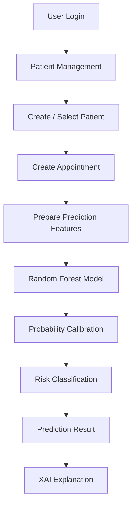

# 🏥 Medi Vision

### AI-Powered Hospital Appointment No-Show Prediction System

Medi Vision is a healthcare AI application designed to help hospital staff identify patients who may be at higher risk of missing scheduled appointments.

The system combines **patient and appointment data, machine learning, explainable AI, and appointment management** into a single application.

---

## 📌 Project Overview

Missed hospital appointments can reduce resource utilization and make appointment scheduling less efficient.

Medi Vision uses a machine learning model to estimate the probability of a patient missing an appointment and presents the result as a risk level to support staff decision-making.

> **Important:** Medi Vision is a decision-support prototype. Its predictions are model outputs and should not be treated as medical diagnoses or definitive conclusions about a patient.

---

## ✨ Key Features

* 👤 Patient management
* 📅 Appointment scheduling
* 🤖 AI-based no-show prediction
* 📊 Risk probability and risk classification
* 🔎 Explainable AI (XAI)
* 📈 Feature importance analysis
* 🧪 Local sensitivity analysis
* 💳 Payment information management
* 🔐 User authentication
* 🗃️ SQLite database integration
* 📁 Structured data preprocessing
* 💾 ML model versioning with Git LFS

---

## 🔄 System Workflow



---

## 🤖 Machine Learning

### Model

The current prediction model is based on:

* **Algorithm:** Random Forest
* **Input features:** 24
* **Classification threshold:** 0.39
* **Probability calibration:** Sigmoid calibration
* **Model pipeline:** Saved and version-controlled using Git LFS

The system separates the model's prediction probability from the final classification decision.

### Risk Classification

The system uses a fixed probability threshold of **0.39** for its classification decision.

The threshold is a project configuration and should not be interpreted as a universal clinical threshold.

---

## 🔎 Explainable AI

Medi Vision includes explainability features to help users understand model behaviour.

### Permutation Feature Importance

Permutation feature importance is used to examine how individual features affect model performance.

This provides a model-independent explanation that can be easier for non-technical healthcare staff to understand.

### Local Sensitivity Analysis

For an individual prediction, the system can change one feature at a time and observe how the prediction changes.

This helps demonstrate the model's sensitivity to individual input values.

> XAI results describe **model behaviour**. They do not establish medical causation.

---

## 🗂️ Project Structure

```text
Medi-Vision/
│
├── data/
│   ├── raw/
│   │   ├── Medi_Vision_ai_dataset_1000.csv
│   │   └── Medi_Vision_ai_dataset_data_dictionary.csv
│   │
│   └── processed/
│       ├── Medi_Vision_preprocessed_scaled.csv
│       ├── Medi_Vision_preprocessed_unscaled.csv
│       └── fairness_columns.csv
│
├── models/
│   ├── calibrated_probability_model.pkl
│   ├── selected_model_pipeline.pkl
│   ├── feature_medians.json
│   └── selected_model_info.json
│
├── auth.py
├── backend.py
├── database.py
├── frontend.py
├── style.css
├── requirements.txt
├── .gitignore
├── .gitattributes
└── README.md
```

---

## 🧩 Main Components

| File / Folder      | Purpose                                |
| ------------------ | -------------------------------------- |
| `frontend.py`      | Application user interface             |
| `backend.py`       | Backend and prediction logic           |
| `database.py`      | Database operations and initialization |
| `auth.py`          | Authentication functionality           |
| `style.css`        | Application styling                    |
| `models/`          | Trained ML models and configuration    |
| `data/raw/`        | Original project datasets              |
| `data/processed/`  | Processed datasets                     |
| `requirements.txt` | Python dependencies                    |

---

## 💾 Database

Medi Vision uses a local SQLite database.

The application database is:

```text
MediVision.db
```

The database is generated locally and is intentionally excluded from Git using `.gitignore`.

This prevents local database files from being committed to the repository.

---

## 📊 Dataset

The project currently uses a synthetic/dummy healthcare appointment dataset.

Main dataset:

```text
data/raw/Medi_Vision_ai_dataset_1000.csv
```

The data dictionary is available at:

```text
data/raw/Medi_Vision_ai_dataset_data_dictionary.csv
```

The dataset is intended for project development, demonstration, and academic evaluation.

It should not be considered a real clinical dataset.

---

## 🛠️ Technology Stack

### Programming

* Python

### Machine Learning

* Scikit-learn
* Random Forest
* Probability Calibration
* Explainable AI techniques

### Application

* Streamlit
* SQLite
* Python-based backend

### Data Processing

* Pandas
* NumPy

### Development Tools

* Git
* GitHub
* Git LFS
* VS Code

---

## ⚙️ Installation

### 1. Clone the repository

```bash
git clone https://github.com/NisalDamsika/Medi-Vision.git
cd Medi-Vision
```

### 2. Create a virtual environment

```bash
python -m venv .venv
```

### 3. Activate the environment

Windows:

```bash
.venv\Scripts\activate
```

### 4. Install dependencies

```bash
pip install -r requirements.txt
```

### 5. Initialize the database

```bash
python database.py
```

### 6. Run the application

Use the project's configured Streamlit entry point, for example:

```bash
streamlit run frontend.py
```

---

## 🧪 Model Files

The trained model artifacts are stored in:

```text
models/
```

The large `.pkl` files are managed using **Git LFS**.

Current LFS-managed models include:

```text
models/calibrated_probability_model.pkl
models/selected_model_pipeline.pkl
```

This keeps large binary model files manageable without storing them directly as normal Git blobs.

---

## 🌿 Git Workflow

The repository follows a feature-branch workflow.

### Main Branch

```text
main
```

`main` represents the stable project version.

### Branch Types

```text
feature/<name>
fix/<name>
docs/<name>
refactor/<name>
test/<name>
```

Example:

```text
docs/update-readme
feature/update-database-config
```

### Development Workflow

```text
Create Branch
     ↓
Develop
     ↓
Test
     ↓
Commit
     ↓
Push Branch
     ↓
Pull Request
     ↓
Review
     ↓
Merge to main
```

---

## 📝 Commit Convention

The project uses Conventional Commit-style messages.

Examples:

```text
feat: add appointment prediction
fix: update database configuration
docs: update Medi Vision README
refactor: improve prediction pipeline
test: add model validation tests
chore: update project configuration
```

---

## 🔐 Repository Security

The repository excludes common sensitive or local files through `.gitignore`, including:

* Environment files
* Database files
* Credentials
* Private keys
* Python cache files
* IDE configuration
* Temporary files
* Local logs

Never commit real patient information, passwords, API keys, or other confidential healthcare data.

---

## 🚀 Future Improvements

Potential future development areas include:

* Model performance monitoring
* Additional ML model comparisons
* Improved model calibration
* More advanced XAI methods
* Automated model evaluation
* Fairness evaluation
* Cloud deployment
* Role-based access control
* Production-grade database integration
* Automated testing and CI/CD

---

## 🎯 Project Goal

Medi Vision aims to demonstrate how machine learning can be integrated into a healthcare appointment management workflow to provide data-driven no-show risk information and interpretable model insights.

The project focuses on combining:

**Healthcare Data + Machine Learning + Explainable AI + Application Development**

into a practical end-to-end prototype.

---

## 👥 Project

**Medi Vision**

AI-Powered Hospital Appointment No-Show Prediction System

Developed as an academic AI/ML project.

---

## 📄 License

This project is developed for academic and demonstration purposes.
